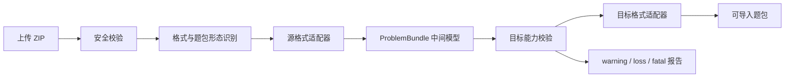

# OJ 题包转换器

一个面向竞赛出题人和 OJ 管理员的本地 Web 工具，用于识别、检查并转换不同
Online Judge 的 ZIP 题包。

项目由 React Web UI、FastAPI 任务服务和隔离 Docker runner 组成。它支持单题包
与多题包，使用统一的 `ProblemBundle` 中间模型保留题面、样例、测试数据、分组、
checker、interactor、附件和标程，并对无法无损映射的内容生成结构化报告。

当前版本：`0.6.0`

> [!IMPORTANT]
> 默认启动方式只监听 `127.0.0.1`，适合本机使用。不要把 Vite 或 Uvicorn
> 开发服务直接暴露到公网。服务器部署请使用仓库提供的 Caddy、systemd 和
> production 配置，详见 [生产部署](#生产部署)。

## 功能概览

- 自动识别 Polygon、ProbHub、HydroOJ、ICPC、HOJ、FPS、QDUOJ、UOJ、
  DMOJ 和普通测试数据目录。
- 同时识别单题包、多题比赛包、ProbHub Workspace、嵌套单题 ZIP 和 XML 集合。
- 支持选择多题包中的全部题目或指定题目转换。
- 支持 HydroOJ、ICPC、HOJ、FPS、QDUOJ、UOJ 和 DMOJ 作为输出格式。
- 通过可恢复的增量 Server-Sent Events 实时显示阶段进度、当前题目、心跳和日志；
  断线后按字节游标续传，不重复下载完整日志。
- 使用 SQLite 持久化任务索引；上传、日志、报告和产物保存在独立任务目录。
- 提供 Prometheus 指标和 JSON 结构化请求/任务日志，便于接入现有监控系统。
- 使用 `warning`、`loss`、`fatal` 区分默认值、有损映射和判题语义错误。
- 提供缺失答案、checker、validator 等文件的受控修复建议；修复会创建派生任务，
  不修改原始 ZIP。
- 每次转换在无网络、只读根文件系统和资源受限的 Docker 容器中运行。
- 提供 `linux/amd64`、`linux/arm64` 预构建 runner，以及仅
  `linux/amd64` 的 Wine runner。
- 支持 macOS、Linux 和 Windows WSL2。

## 工作原理



Polygon 转 HydroOJ 和 legacy ICPC 继续使用经过验证的专用链路。其他转换通过
统一中间模型完成，避免为每一对格式维护独立转换器。

## 支持矩阵

| 格式 ID | 平台或规范 | 读取 | 输出 | 支持的题包形态 |
|---|---|:---:|:---:|---|
| `polygon` | Polygon、Codeforces | 支持 | 不支持 | 单题源包、比赛包 |
| `probhub` | ProbHub Workspace、Legacy、Core | 支持 | 不支持 | 单题目录、多题工作区 |
| `hydro` | HydroOJ | 支持 | 支持 | 单题、多题 |
| `icpc` | DOMjudge、Kattis、PC² | 支持 | 支持 | 单题、目录多题、嵌套 ZIP |
| `hoj` | HOJ | 支持 | 支持 | 单题、多题 |
| `fps` | HUSTOJ FPS、QDUOJ FPS | 支持 | 支持 | 单题 XML、多题 XML |
| `qduoj` | QingdaoU OnlineJudge | 支持 | 支持 | 单题、多题 |
| `uoj` | UOJ Community | 支持 | 支持 | 单题、目录多题、嵌套 ZIP |
| `dmoj` | DMOJ、LQDOJ | 支持 | 支持 | 单题、目录多题、嵌套 ZIP |
| `generic` | 洛谷数据、Lemon、普通目录 | 支持 | 不支持 | 单题、多题推断目录 |

源格式不会出现在输出格式列表中。Polygon、ProbHub 和 Generic 当前只作为输入
格式；其余格式可在目标能力允许时相互转换。

## 五分钟启动

### 环境要求

- Python 3.10 或更新版本。
- Node.js 20.19+、22.12+ 或 24+。
- Docker Engine 和 Docker Compose 插件。
- macOS 可使用 Docker Desktop。
- Windows 使用 WSL2 和 WSL 内可访问的 Docker。

先确认当前普通用户可以访问 Docker：

```bash
docker info
docker compose version
```

不要使用 `sudo ./install.sh` 或 `sudo ./scripts/start.sh`。这样容易产生 root
所有的虚拟环境、依赖和任务文件。

### 安装

```bash
git clone https://github.com/LMTINSUZHOU/Polygon-to-Hydro-or-Domujudge-Web-UI.git
cd Polygon-to-Hydro-or-Domujudge-Web-UI
./install.sh
```

安装器会：

1. 检查 Python、Node.js、npm、Docker 和 Docker Compose。
2. 创建 `backend/.venv` 并安装后端依赖。
3. 使用 `npm ci` 安装前端依赖并执行生产构建。
4. 构建本机架构的 `p2h-runner` 镜像。
5. 首次运行时创建本地 `.env`。

后端使用带 SHA256 哈希的 `backend/requirements.lock` 安装。该锁文件覆盖项目支持
的 Python 3.10+ 与 Linux、macOS、Windows 平台标记，安装时会拒绝内容与哈希
不一致的依赖包。

### 启动

```bash
./scripts/start.sh
```

打开：

- Web UI：[http://127.0.0.1:5173](http://127.0.0.1:5173)
- API 文档：[http://127.0.0.1:8000/docs](http://127.0.0.1:8000/docs)

按 `Ctrl+C` 同时停止前后端。

也可以单独启动：

```bash
./scripts/start.sh --backend-only
./scripts/start.sh --frontend-only
```

## Linux 国内网络与清华源

Debian/Ubuntu 用户可以把 runner 构建中的 Debian 和 Debian Security 源切到
清华 TUNA：

```bash
./install.sh \
  --apt-mirror https://mirrors.tuna.tsinghua.edu.cn/debian \
  --apt-security https://mirrors.tuna.tsinghua.edu.cn/debian-security
```

同时临时指定 PyPI 和 npm 镜像：

```bash
PIP_INDEX_URL=https://pypi.tuna.tsinghua.edu.cn/simple \
npm_config_registry=https://registry.npmmirror.com \
./install.sh \
  --apt-mirror https://mirrors.tuna.tsinghua.edu.cn/debian \
  --apt-security https://mirrors.tuna.tsinghua.edu.cn/debian-security
```

如果 Docker Hub 基础镜像不可达，安装器会尝试内置镜像地址，也可以显式指定：

```bash
./install.sh \
  --base-image docker.m.daocloud.io/library/python:3.14-slim-trixie \
  --apt-mirror https://mirrors.tuna.tsinghua.edu.cn/debian \
  --apt-security https://mirrors.tuna.tsinghua.edu.cn/debian-security
```

如果宿主机代理只监听 `127.0.0.1`，构建容器无法访问它。安装器通常会自动忽略
这类代理；仍然失败时使用：

```bash
./install.sh --no-build-proxy
```

## 使用预构建 runner

`main` 分支会发布：

- `ghcr.io/lmtinsuzhou/p2h-runner:main`
  - `linux/amd64`
  - `linux/arm64`
- `ghcr.io/lmtinsuzhou/p2h-runner-wine:main`
  - `linux/amd64`

`Pre` 分支每次推送还会发布同平台范围的滚动测试标签 `:pre`；正式部署使用
版本标签或镜像 digest，不固定到会持续移动的 `:pre`。

跳过本机构建并直接安装：

```bash
./install.sh \
  --runner-image ghcr.io/lmtinsuzhou/p2h-runner:main
```

只有题包必须执行 binary-only Windows `.exe` 时才使用 Wine：

```bash
./install.sh \
  --runner-image ghcr.io/lmtinsuzhou/p2h-runner-wine:main
```

生产环境不要长期跟随可变的 `main` 标签，应固定发布 digest：

```text
P2H_RUNNER_IMAGE=ghcr.io/lmtinsuzhou/p2h-runner@sha256:<digest>
```

GitHub Actions 还会生成 `sha-<commit>` 和版本标签，并附带 provenance 与 SBOM。

## Windows 兼容

项目不原生支持 Windows PowerShell 或 Windows Docker 路径。推荐方案：

1. 安装 WSL2 和 Ubuntu。
2. 安装 Docker Desktop，并启用 WSL Integration。
3. 在 WSL 终端内克隆仓库。
4. 在 WSL 内执行 `docker info`、`./install.sh` 和 `./scripts/start.sh`。
5. 在 Windows 浏览器打开 `http://127.0.0.1:5173`。

不要把仓库放在 `/mnt/c` 后运行大量转换任务；Linux 文件系统中的 home 目录通常
有更好的小文件和权限性能。

Polygon 的 Windows 导出包可能同时包含 `.exe` 和 C/C++ 源码。普通 runner
会优先在 Linux 内原生重编译源码，因此大多数情况不需要 Wine。只有缺少源码、
必须执行 Windows 二进制时才需要 Wine runner。

## Web 使用流程

1. 上传 ZIP 题包。
2. 检查自动识别的格式、题包形态、题目数和候选证据。
3. 置信度不足时手动选择输入格式。
4. 多题包选择全部题目或指定题目。
5. 选择输出格式及其专属参数。
6. 启动转换，观察实时进度和日志。
7. 检查转换报告。
8. 下载成功产物，并在目标 OJ 的测试实例中复核。

格式自动识别只有在唯一候选置信度达到 `0.8` 时才会采用。出现格式冲突或结构
不足时，系统会展示候选证据，不会静默猜测。

界面中的“格式能力矩阵”使用独立弹窗展示，移动端可在弹窗内部横向滚动。

## ProbHub 兼容

支持 [ProbHub Skill](https://github.com/greenthree/ProbHub-skill) 的三类导出：

### Workspace Schema v1

- 读取 `.probhub/workspace.yaml` 中的稳定题序。
- 读取每题的 `probhub.yaml`、`problem.md`、`data/`、`code/` 和 `assets/`。
- 支持单题工作区和多题工作区。
- `data/sample` 中的 `inputN`、`outputN` 会转换为 Markdown 样例。
- 题面已经包含相同样例时不会重复追加。

### ProbHub Legacy

- 支持单题目录中的 `meta.json`、`problem*.md`、`data/` 和源码。
- 源码可位于题目根目录或 `code/`。
- 自动排除 `.exe`、`tmp/` 等构建产物和临时目录。

### ProbHub Core / DOMjudge ZIP

- 支持根目录 `problem.pdf`。
- 支持 `data/sample`、`data/secret`。
- 支持 `input_validators/`、`output_validators/validate/` 和 submissions。

ProbHub 可映射题目 ID、标题、标签、限制、样例、隐藏数据、validator、
checker/interactor、accepted solution 和资源文件。Generator、stress、brute、
wrong solution 期望等出题期信息会尽量作为源码附件保留，并在不能等价表达时
登记 `loss`。

ProbHub 当前是只读输入格式。转换到 ICPC 时生成标准 DOMjudge/Kattis 题包，
不会重建可继续编辑的 ProbHub Workspace。

## 多题包识别与选择

| 源格式 | 单题依据 | 多题依据 |
|---|---|---|
| Polygon | 单个 `problem.xml` | `contest.xml` 和 `problems/*/problem.xml` |
| ProbHub | Core ZIP、Legacy 目录 | Workspace 中的题目列表 |
| HydroOJ | 一组题面和 testdata | 多个题目目录 |
| ICPC | 单题根目录 | 多个题目目录或多个嵌套 ZIP |
| HOJ | 一组 JSON 和数据目录 | 多组成对 JSON 和目录 |
| FPS | 一个 `<item>` | 多个 `<item>` |
| QDUOJ | 一个编号目录 | 多个编号目录 |
| UOJ | 一个 `problem.conf` | 多个目录或嵌套 ZIP |
| DMOJ | 一个 `init.yml` | 多个目录或嵌套 ZIP |
| Generic | 一组 `.in/.out/.ans` | 多个顶层题目目录 |

检查接口返回准确题目总数和最多 200 个题目标识预览。题目数量较少时，Web UI
直接显示复选框；更大的包使用题目标识输入。

## 转换报告

| 级别 | 含义 | 行为 |
|---|---|---|
| `warning` | 使用默认时限、内存、语言或标题 | 继续并记录 |
| `loss` | 目标格式无法表达某些源字段或平台元数据 | 由 loss policy 决定 |
| `fatal` | 测试数据、checker 或交互语义不完整 | 始终失败 |

`loss_policy`：

- `warn`：默认。允许有损转换，同时生成报告。
- `error`：任何 `loss` 都使任务失败，适合迁移验收和 CI。

报告 schema v2 包含：

- 源格式、目标格式和问题数量。
- warning、loss、fatal 详情。
- 目标产物清单。
- 语义摘要。
- 缺失文件修复建议。
- 已应用修复和父任务关系。

失败任务不会提供 writer 留下的半成品。只有完整通过输出校验的结果才会原子发布。

## 缺失文件修复

转换器不会伪造会影响判题结果的文件。

| 问题 | 结果 | 建议 |
|---|---|---|
| 输入缺少对应答案 | `fatal` | 恢复 `.out/.ans` |
| 配置声明的数据文件不存在 | `fatal` | 补回文件或修正源配置 |
| checker、interactor、validator 缺失 | `fatal` | 恢复原始源码 |
| 整个题面缺失 | 通常为 `loss` | 添加 Markdown、HTML 或 PDF sidecar |
| 元数据损坏 | 读取失败 | 修复或重新导出 |
| 自动识别冲突 | 不自动启动 | 手动选择源格式 |

候选置信规则：

- 仅大小写不同：`1.0`
- 同目录、同 stem、已知答案扩展名变化：`0.95`
- ZIP 中其他目录的唯一同名文件：`0.85`
- 低于 `0.8` 或存在歧义：不自动推荐

用户确认后，系统保留原任务和原 ZIP，写入 `repair-plan.json`，再创建派生任务
重新转换。补充文件仍会经过路径、大小、重复名称、符号链接和压缩预算检查。

## 格式要点

### Polygon

- 支持单题导出和比赛包。
- `doall.sh` 默认关闭，只有用户显式启用才执行。
- 有 C/C++ 源码时优先在 Linux runner 内原生重编译。
- binary-only Windows 程序才需要 Wine。

### HydroOJ

- 读取和输出 `problem.yaml`、`problem_<语言>.md`、
  `testdata/config.yaml`、数据和 `additional_file/`。
- 支持 ACM/OI、文件 IO、子任务依赖、checker、interactor、模板、附件和标程。

### ICPC / DOMjudge / Kattis

- 支持 legacy 和 `2025-09` profile。
- 默认输出 `legacy-icpc`，兼容当前 DOMjudge/Kattis 工具链。
- `2025-09` 要求至少一个 accepted solution。
- PDF 转 HydroOJ 时复制 PDF，并生成 `@[pdf](file://文件名)` 引用。

### HOJ、FPS、QDUOJ、UOJ、DMOJ

- HOJ 使用原生 `problem_*.json` 和数据目录。
- FPS 支持 HUSTOJ 1.6 与 QDUOJ 1.2 profile，并防护 XML 实体和 XML Bomb。
- QDUOJ 使用编号目录、`problem.json` 和 `testcase/`。
- UOJ 支持 `problem.conf`、普通/额外测试、子任务和 checker。
- DMOJ 支持 `init.yml`、batch、dependency、archive、bridged checker 和 interactor。

### Generic

- 递归匹配 `.in` 与 `.out/.ans`。
- 识别 `sample/`、PDF、Markdown 和常见 checker。
- 缺少限制时默认 1 秒、256 MiB，并生成 warning。

## 配置

默认值参见 [.env.example](.env.example)。

| 变量 | 默认值 | 用途 |
|---|---:|---|
| `P2H_DATA_DIR` | `~/.p2h-web-ui/backend_data` | 任务、SQLite、日志和产物 |
| `P2H_RUNNER_IMAGE` | `p2h-runner` | runner 镜像 |
| `P2H_MAX_UPLOAD_BYTES` | `536870912` | 上传上限 |
| `P2H_JOB_TIMEOUT_SECONDS` | `7200` | 总超时 |
| `P2H_JOB_IDLE_TIMEOUT_SECONDS` | `300` | 无活动超时 |
| `P2H_JOB_STAGE_TIMEOUT_SECONDS` | `1800` | 单阶段超时 |
| `P2H_JOB_PROBLEM_TIMEOUT_SECONDS` | `1200` | 单题超时 |
| `P2H_JOB_TTL_SECONDS` | `86400` | 终态任务保留时间 |
| `P2H_MAX_CONCURRENT_JOBS` | `2` | 最大并发任务数 |
| `P2H_MAX_STORED_JOBS` | `100` | 最大保存任务数 |
| `P2H_MAX_STORAGE_BYTES` | `10737418240` | 任务存储上限 |
| `P2H_DOCKER_MEMORY` | `1g` | runner 内存 |
| `P2H_DOCKER_CPUS` | `2` | runner CPU |
| `P2H_DOCKER_WORK_SIZE` | `1g` | 工作区 tmpfs |
| `P2H_DOCKER_OUTPUT_SIZE` | `1g` | 输出 tmpfs |
| `P2H_DEPLOYMENT_MODE` | `local` | `local` 或 `production` |
| `P2H_BACKEND_HOST` | `127.0.0.1` | 后端监听地址 |
| `P2H_BACKEND_PORT` | `8000` | 后端端口 |
| `P2H_FRONTEND_HOST` | `127.0.0.1` | 前端监听地址 |
| `P2H_FRONTEND_PORT` | `5173` | 前端端口 |

任务索引位于 `P2H_DATA_DIR/jobs.sqlite3`，SQLite 使用 WAL 模式。每个任务仍保留
独立元数据和产物目录，启动时会自动回填或清理索引。

## CLI

runner 的统一命令：

```bash
package-convert INPUT.zip \
  --source-format auto \
  --target-format hydro \
  --loss-policy warn \
  -o OUTPUT
```

常用参数：

```text
--source-format auto|polygon|probhub|hydro|icpc|hoj|fps|qduoj|uoj|dmoj|generic
--target-format hydro|icpc|hoj|fps|qduoj|uoj|dmoj
--loss-policy warn|error
--only ID
--pid-start P1000
--owner 1
--code-start A
--icpc-profile legacy-icpc|2025-09
--fps-profile hustoj-1.6|qduoj-1.2
--run-doall
--progress-format text|jsonl|none
--total-timeout 7200
--idle-timeout 300
--stage-timeout 1800
--problem-timeout 1200
```

查看完整帮助：

```bash
docker run --rm p2h-runner package-convert --help
```

## API

| 方法 | 路径 | 说明 |
|---|---|---|
| `GET` | `/api/health` | 兼容健康检查 |
| `GET` | `/api/health/live` | 进程存活 |
| `GET` | `/api/health/ready` | 数据目录、Docker 和镜像就绪 |
| `GET` | `/metrics` | Prometheus 文本指标 |
| `POST` | `/api/inspect` | 上传并识别 ZIP |
| `POST` | `/api/jobs` | 启动任务 |
| `GET` | `/api/jobs/{id}` | 查询状态 |
| `GET` | `/api/jobs/{id}/events` | SSE 状态、日志与心跳 |
| `GET` | `/api/jobs/{id}/logs` | 获取完整日志 |
| `GET` | `/api/jobs/{id}/report` | 获取转换报告 |
| `POST` | `/api/jobs/{id}/cancel` | 取消并保留诊断 |
| `GET` | `/api/jobs/{id}/repairs` | 获取修复建议 |
| `POST` | `/api/jobs/{id}/repairs` | 创建修复派生任务 |
| `GET` | `/api/jobs/{id}/download` | 下载成功产物 |
| `DELETE` | `/api/jobs/{id}` | 清理终态任务 |

上传示例：

```bash
curl -F 'file=@contest.zip;type=application/zip' \
  http://127.0.0.1:8000/api/inspect
```

完整请求模型和交互式调试使用 `/docs`。

任务事件的 SSE `id` 格式为 `revision:log_byte_offset`。浏览器会自动使用事件 ID
恢复连接；其他客户端可发送 `Last-Event-ID`，也可使用
`?cursor=<revision>:<offset>`。`logs` 事件只返回新增日志片段，原
`/api/jobs/{id}/logs` 完整日志接口保持兼容。

## 可观测性

`/metrics` 使用 Prometheus 文本格式，包含 HTTP 请求数与耗时、活跃/完成任务、
转换耗时、语义损失数和任务存储占用。指标标签只使用有界的路由、状态和格式，
不写入任务 ID 或文件名，避免高基数和题目信息泄露。

```bash
curl http://127.0.0.1:8000/metrics
```

后端请求和任务完成日志以单行 JSON 输出到 stderr。请求日志包含 `request_id`、
方法、路由、状态码和耗时；任务日志包含状态、源/目标格式、耗时和 loss 数量。
生产环境可直接通过 journald 收集，并按 `request_id` 关联请求与响应头。

## 安全边界

### ZIP 和元数据

- 拒绝路径穿越、绝对路径、符号链接、重复名称和大小写冲突。
- 限制条目数、总展开大小、单文件大小和压缩比。
- 小于等于 16 MiB 的合法高压缩率测试数据不会仅因压缩比被拒绝。
- 更大的单成员默认压缩比上限为 200。
- 嵌套 ZIP 共享同一展开预算。
- JSON、YAML、XML 都有大小、深度、节点数和重复键限制。

### Docker runner

- 每个任务使用一次性容器。
- 容器无网络、根文件系统只读、上传包只读挂载。
- 限制 CPU、内存、PID 和 tmpfs。
- 转换进程使用非 root UID/GID、空 capability 和 `no-new-privileges`。
- 转换 namespace 不能直接看到宿主结果挂载。
- 失败时只复制结构化报告，不复制半成品。

除用户显式启用的 Polygon `doall.sh` 外，转换器不会执行导入包中的 generator、
validator、checker、interactor 或脚本。

Docker 是风险降低措施，不是绝对沙箱。处理高风险第三方题包时，应使用独立主机、
VM、gVisor、Kata Containers 或更强隔离。

## 生产部署

仓库提供：

- [deploy/production.env.example](deploy/production.env.example)
- [deploy/Caddyfile](deploy/Caddyfile)
- [deploy/systemd/oj-package-converter.service](deploy/systemd/oj-package-converter.service)
- [scripts/production-check.sh](scripts/production-check.sh)
- [完整生产部署手册](deploy/README.md)

推荐拓扑：

```text
Internet
   |
 Caddy :443
   |  HTTPS + Basic Auth + request limits
   v
 FastAPI 127.0.0.1:8000
   |
 rootless Docker
   |
 isolated runner
```

生产环境要求：

- 专用 Linux 主机或 VM。
- Caddy 2.10+。
- rootless Docker 和 cgroup v2。
- FastAPI 固定单 worker。
- 仅开放 80/443。
- 使用随机代理密钥并固定 runner digest。

不要直接使用 `./scripts/start.sh` 提供公网服务。

推送 `v*` 标签会创建确定性的源码 `tar.gz`、SHA256 校验文件和 GitHub build
provenance，并自动生成 GitHub Release Notes。部署时同时固定源码版本和 runner
镜像 digest；校验文件和 provenance 用于确认发布产物来自对应提交。

## 测试

后端：

```bash
cd backend
.venv/bin/python -m pytest -q \
  --cov=app --cov-report=term-missing --cov-fail-under=75
```

前端：

```bash
cd frontend
npm test -- --run
npm run build
npm run test:e2e
```

静态与安全检查：

```bash
backend/.venv/bin/ruff check backend runner compat
backend/.venv/bin/ruff format --check backend runner compat
backend/.venv/bin/bandit -q -r backend/app runner
backend/.venv/bin/pip check
backend/.venv/bin/pip-audit -r backend/requirements.lock
shellcheck install.sh scripts/*.sh runner/entrypoint.sh
python3 compat/check_lock.py
```

Docker 隔离探针：

```bash
docker compose --profile runner build runner
./scripts/test-runner-isolation.sh p2h-runner
```

兼容语料由项目确定性生成，不包含真实比赛私有题目：

```bash
python3 compat/corpus/build.py /tmp/oj-compat-corpus
```

详见 [兼容验证说明](compat/README.md) 和
[语料说明](compat/corpus/README.md)。

## 常见问题

### `archive member exceeds compression ratio limit`

上传包触发了 Zip Bomb 防护。小于等于 16 MiB 的高压缩率成员允许导入；更大
成员超过 200 倍压缩率时会被拒绝。请检查是否包含异常重复数据、稀疏文件或错误
打包的构建目录。单文件 256 MiB 和总展开 1 GiB 等上限仍然生效。

### `No space left on device`

- 解压、生成或编译阶段：增大 `P2H_DOCKER_WORK_SIZE`
- 输出阶段：增大 `P2H_DOCKER_OUTPUT_SIZE`
- Wine prefix：增大 `P2H_DOCKER_WINE_HOME_SIZE`

同时检查 Docker Desktop 或宿主机磁盘空间。

### Docker build 下载失败

```bash
./install.sh --no-build-proxy
./install.sh \
  --apt-mirror https://mirrors.tuna.tsinghua.edu.cn/debian \
  --apt-security https://mirrors.tuna.tsinghua.edu.cn/debian-security
./install.sh \
  --base-image docker.m.daocloud.io/library/python:3.14-slim-trixie
```

### Apple Silicon 上 Wine 崩溃

`linux/amd64`、QEMU 和 Wine 的组合可能出现 `free(): invalid pointer` 或
`qemu: uncaught target signal 6`。优先使用普通 ARM64 runner 和题包内源码。
只有 binary-only Windows 题包才使用 Wine。

### 任务消失

终态任务超过 `P2H_JOB_TTL_SECONDS`，或数量、总存储达到上限时，会在后续 API
请求中清理。重要结果应及时下载。

### 路径在 Windows 正常、Linux 失败

Linux 区分大小写。`Check.cpp`、`check.cpp` 是两个不同文件。请修正配置引用并
重新打包。

## 项目结构

```text
backend/                     FastAPI、SQLite 索引、任务状态、Docker 调度
frontend/                    React 19、Vite、TypeScript、Vitest、Playwright
runner/                      中间模型、安全转换入口和格式兼容逻辑
runner/adapters/             各格式读写适配器、协议、工厂与唯一注册表
compat/                      平台版本锁和原创兼容语料
deploy/                      Caddy、systemd、生产配置和运维手册
scripts/                     安装、启动、扫描、预检和隔离测试
security/                    隔离探针与安全说明
docker-compose.yml           普通和 Wine runner 构建
install.sh                   一键安装入口
```

## 参与贡献

新增格式或扩展兼容时应：

1. 实现检测、读取、目标能力校验和写出。
2. 不执行导入包中的脚本或二进制。
3. 对无法表达的语义生成明确的 `loss` 或 `fatal`。
4. 添加最小 fixture、格式到 IR、IR 到格式和矩阵测试。
5. 更新支持矩阵和格式限制。

欢迎提交 issue、兼容 fixture、真实平台验证结果和 Pull Request。不要提交私有
比赛题包、管理员凭据、访问日志或用户上传数据。

## 致谢

本项目参考和使用了以下开源项目与规范：

- [polygon2hydro](https://github.com/KisuraOP/polygon2hydro)
- [Polygon2DOMjudge](https://github.com/cn-xcpc-tools/Polygon2DOMjudge)
- [ProbHub Skill](https://github.com/greenthree/ProbHub-skill)
- [Hydro](https://github.com/hydro-dev/Hydro)
- [DOMjudge](https://www.domjudge.org/)
- [ICPC Problem Package Format](https://icpc.io/problem-package-format/)
- [Kattis problemtools](https://github.com/Kattis/problemtools)
- [HOJ](https://github.com/HimitZH/HOJ)
- [HUSTOJ](https://github.com/zhblue/hustoj)
- [QDUOJ](https://github.com/QingdaoU/OnlineJudge)
- [UniversalOJ](https://github.com/UniversalOJ/UOJ-System)
- [DMOJ](https://github.com/DMOJ/judge-server)
- [FastAPI](https://fastapi.tiangolo.com/)
- [React](https://react.dev/)
- [Vite](https://vite.dev/)
- [Docker](https://www.docker.com/)

这些项目分别遵循各自许可证；本仓库许可证不替代其许可证要求。

## 许可证

本项目使用 [MIT License](LICENSE)。

Copyright © 2026 Albert_Li.
