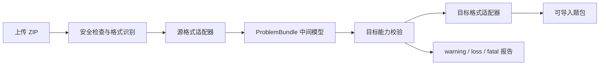

# OJ 题包转换器 Web UI

一个本地运行、面向竞赛出题人与 OJ 管理员的多格式题包转换工具。

项目提供 React Web 界面、FastAPI 任务服务和隔离 Docker runner，可自动识别题包格式、转换题面与评测数据、展示实时日志，并对无法无损表达的字段生成结构化报告。除 Polygon 的成熟优化链路外，其他格式统一经过 `ProblemBundle` 中间模型，因此不需要为每一种源/目标组合维护独立转换器。

> [!IMPORTANT]
> 本项目默认仅监听 `127.0.0.1`，没有用户认证。不要把服务直接暴露到局域网或公网；远程部署时必须在前面配置身份认证、TLS、限速和上传大小限制。

## 主要功能

- 自动识别 Polygon、Hydro、ICPC、HOJ、FPS、QDUOJ、UOJ、DMOJ 和普通目录题包。
- 支持所有可读格式到所有可写格式的统一转换；相同格式的无意义转换除外。
- 保留多语言题面、Markdown/HTML/PDF、测试点、样例、分组、依赖、checker、interactor、模板、附件和标程等信息。
- DOMjudge/ICPC PDF 转 Hydro 时复制原 PDF，并使用 `@[pdf](file://文件名)` 生成 Hydro 题面引用。
- 用 `warning`、`loss`、`fatal` 三级报告区分默认值、有损映射和影响判题正确性的错误。
- Polygon 包可显式运行 `doall.sh`；包含 C/C++ 源码时会优先在 Linux 内原生重编译，避免依赖 Wine。
- 对上传、解压、任务调度、容器运行、输出复制和结果打包实施分层安全限制。
- 保留旧版七条转换命令和旧 API 字段，便于平滑升级。

## 目录

- [支持的格式](#支持的格式)
- [快速开始](#快速开始)
- [使用流程](#使用流程)
- [转换与损失报告](#转换与损失报告)
- [格式说明](#格式说明)
- [缺失文件如何处理](#缺失文件如何处理)
- [安装与配置](#安装与配置)
- [CLI](#cli)
- [API](#api)
- [安全模型](#安全模型)
- [测试与验收](#测试与验收)
- [常见问题](#常见问题)
- [致谢](#致谢)
- [许可证](#许可证)

## 支持的格式

| 格式 ID | 覆盖平台/规范 | 读取 | 输出 | 包完整性与备注 |
|---|---|:---:|:---:|---|
| `polygon` | Polygon、Codeforces 出题链 | ✓ | — | 完整题面与评测包；保留优化转换路径 |
| `hydro` | HydroOJ | ✓ | ✓ | 能力最完整的中心格式 |
| `icpc` | DOMjudge、Kattis、PC² | ✓ | ✓ | 支持 legacy 和 `2025-09`；默认输出 `legacy-icpc` 兼容包 |
| `hoj` | HOJ | ✓ | ✓ | 原生 `problem_*.json` 与同名数据目录 |
| `fps` | HUSTOJ、OpenJudger 等 | ✓ | ✓ | 支持 HUSTOJ 1.6、QDUOJ 1.2 profile |
| `qduoj` | QingdaoU OnlineJudge | ✓ | ✓ | 编号目录、`problem.json`、`testcase/` 原生包 |
| `uoj` | UOJ Community | ✓ | ✓ | `problem.conf` 评测数据包；题面使用 sidecar |
| `dmoj` | DMOJ、LQDOJ | ✓ | ✓ | `init.yml` 与 data archive；题面使用 sidecar |
| `generic` | 洛谷测试数据、Lemon、普通目录 | ✓ | — | 推断 PDF/Markdown 与 `.in/.out/.ans` |

`polygon` 和 `generic` 当前是只读源格式。其他格式均可作为源或目标，转换过程为：



Polygon → Hydro 和 Polygon → ICPC 继续使用经过验证的专用路径。Polygon → 其他目标会先生成受控 Hydro 中间包，再进入统一模型。

## 快速开始

### 环境要求

- macOS、Linux，或 Windows WSL2。
- Python 3.10 或更新版本。
- Node.js 20.19+、22.12+ 或 24+。
- Docker Engine + Docker Compose 插件；macOS 推荐 Docker Desktop。
- Bash。

先确认当前用户可以直接访问 Docker：

```bash
docker info
```

不要使用 `sudo ./install.sh` 或 `sudo ./scripts/start.sh`。这会在虚拟环境、依赖目录或任务目录中留下 root 所有文件。

### 安装

```bash
git clone https://github.com/LMTINSUZHOU/Polygon-to-Hydro-or-Domujudge-Web-UI.git
cd Polygon-to-Hydro-or-Domujudge-Web-UI
./install.sh
```

安装器会：

1. 检查 Python、Node/npm、Docker 和 Docker Compose。
2. 创建 `backend/.venv` 并安装后端依赖。
3. 使用 `npm ci` 安装前端依赖并执行生产构建。
4. 构建 `p2h-runner` 镜像。
5. 创建本地 `.env` 配置。

### 启动

```bash
./scripts/start.sh
```

打开 [http://127.0.0.1:5173](http://127.0.0.1:5173)。后端 API 文档位于 [http://127.0.0.1:8000/docs](http://127.0.0.1:8000/docs)。

停止服务时按 `Ctrl+C`。

## 使用流程

1. 上传 ZIP 题包。
2. 查看自动识别结果和候选证据；置信度不足时手动选择源格式。
3. 选择目标格式。
4. 按需填写题号起点、所有者、ICPC profile、FPS profile 等参数。
5. Polygon 包只有在缺少完整测试数据时才启用“运行 `doall.sh`”。
6. 启动任务并查看实时日志。
7. 检查 warning/loss/fatal 报告。
8. 下载题包，并在目标 OJ 的测试环境中做最终复核。

自动识别只有在唯一候选置信度达到 `0.8` 时才会直接采用。格式冲突或结构不足时，系统会返回候选证据，不会静默猜测。

## 转换与损失报告

| 级别 | 含义 | 默认行为 |
|---|---|---|
| `warning` | 使用了默认时限、内存、语言或标题等非关键值 | 继续转换并记录 |
| `loss` | 目标格式无法表达题面字段、分组依赖或平台私有元数据 | `loss_policy=warn` 时继续并记录 |
| `fatal` | 测试数据不成对、必需 checker/interactor 丢失、目标不支持评测语义 | 始终失败 |

`loss_policy` 支持：

- `warn`：默认值。允许有损转换，结果与报告同时生成。
- `error`：任何 `loss` 都提升为失败，适合迁移验收或自动化流水线。

报告通过 Web UI 展示，也可从 `GET /api/jobs/{id}/report` 读取。报告是独立文件，不会混入目标 OJ 的可导入题包。

转换失败时不会提供 writer 留下的半成品；容器只允许导出结构化失败报告。

## 格式说明

### Polygon

- 读取 contest ZIP 中的 `contest.xml`、`problems/<slug>/problem.xml`、题面、测试点和资源。
- `doall.sh` 默认不执行。只有用户显式启用后，runner 才会运行生成器、validator、checker 和主标程。
- Windows 导出的包通常同时包含 `.exe` 和原始 C/C++ 源码。runner 会依据 `problem.xml` 原生重编译，并实时输出：

  ```text
  [problem-slug] native compile 1/4: check.exe
  ```

- 原生重编译成功后无需 Wine，在 Apple Silicon 上也能使用 ARM64 runner。
- `doall.sh` 使用 fail-fast 行为；首个生成、验证或答案错误会立即终止。
- 生成数据和已有 validator fixture 中的 CRLF 会按需要转换为 LF。
- 只有缺少对应源码、必须执行 binary-only Windows 程序时才需要 Wine runner。

### Hydro

- 读取和输出 `problem.yaml`、`problem_<语言>.md`、`testdata/config.yaml`、测试数据和 `additional_file/`。
- 支持 ACM/OI、文件 IO、子任务、依赖、checker、interactor、模板、附件和标程。
- Hydro 是统一模型中能力最完整的格式，也是 Polygon 转其他格式时的受控中间包。

### ICPC / DOMjudge / Kattis

- 输入兼容 legacy `problem_statement/` 与新规范 `statement/`。
- 输出 profile：
  - `legacy-icpc`：默认，面向当前 DOMjudge/Kattis 工具链；`problem.yaml` 声明 `problem_format_version: legacy`。
  - `2025-09`：按新规范输出，要求至少一个 accepted solution。
- `2025-09` 的文本题面写为 `statement/problem.<语言>.tex`；PDF 原样写入同目录。
- `problem.yaml.name` 的语言键与实际题面文件严格一致。
- ICPC/Domjudge PDF → Hydro 时：
  - PDF 复制到 Hydro `additional_file/`。
  - 对每种题面语言生成对应的 `problem_<语言>.md`。
  - Markdown 内容使用 `@[pdf](file://文件名)` 引用原 PDF。
- accepted submissions、validators 和 generators 会尽量保留，无法直接映射的内容进入附件并记录报告。

### HOJ

- 输入使用官方导出结构：顶层成对出现 `problem_*.json` 与同名数据目录。
- 支持 Markdown 题面、样例、标签、时空限制、语言限制、文件 IO、OI 分组、SPJ、交互器和 extra files。
- Hydro → HOJ 会在 ZIP 顶层生成 HOJ 原生 JSON 与数据目录。
- HOJ → ICPC 会输出 `A-slug.zip`、`B-slug.zip` 等独立题包。
- `subtask_average` 无法与所有目标的计分语义完全等价，转换时会保守映射并报告损失。

### FPS

- 安全解析 `problem.xml` 或 `fps.xml`。
- 支持 HUSTOJ 1.6 和 QDUOJ FPS 1.2 profile。
- 映射题面、样例、测试数据、图片、SPJ、interactor、模板和标程。
- 允许合法 DOCTYPE 声明，但禁止实体展开、外部实体和 XML Bomb。
- 对 XML 节点数、深度、文本长度与 Base64 图片总量设置上限。

### QDUOJ

- 使用编号目录、`problem.json` 和 `testcase/`。
- 支持 HTML 题面、ACM/OI、逐点分值、SPJ、模板、答案和标签。
- 文件 IO 等不属于官方导出字段的信息会登记为 `loss`，不会制造近似语义。

### UOJ

- 支持 `problem.conf`、普通测试、额外测试、样例、逐点分值、子任务、内置 checker、`chk.cpp` 和 `val.cpp`。
- 不支持首批范围外的复杂自定义 judger；影响判题语义时会产生 `fatal`。
- 优先读取同包 `statement.md`、`statement.html` 或 `statement.pdf`。
- 没有题面时，为 Hydro 等目标生成醒目占位题面并记录 `loss`。
- 输出包含可上传评测数据包，以及独立题面和 metadata sidecar。

### DMOJ / LQDOJ

- 支持 `init.yml`、显式测试列表、正则匹配、batched groups、dependencies、archive、bridged checker 和 interactor。
- 无法映射的动态 generator 会作为附件保留并记录损失，不会执行或推断其输出。
- 题面处理与 UOJ 类似：优先读取 sidecar，缺失时生成占位题面并报告。

### Generic

- 递归匹配 `.in` 与 `.ans/.out`。
- 识别 `sample/`、PDF/Markdown 题面和常见 checker 文件。
- 缺少限制时默认使用 1 秒、256 MiB，并生成 `warning`。
- Generic 只用于导入结构简单的本地目录，不作为输出格式。

## 缺失文件如何处理

转换器不会猜测或伪造会影响判题结果的文件。

| 情况 | 处理结果 | 建议修复方式 |
|---|---|---|
| `.in` 缺少对应 `.out/.ans` | `fatal` | 从原 OJ 重新导出，检查名称、扩展名和大小写 |
| 配置声明的测试点不存在 | `fatal` | 补回原文件或修正源配置，不要创建空文件 |
| checker、interactor、validator 缺失 | `fatal` | 恢复原始源码并保持配置路径 |
| 交互题缺 interactor | `fatal` | 从原题包恢复；若实际不是交互题，应先修正题型 |
| PDF 或附件清单引用不存在 | `fatal` | 补回文件或删除错误引用后重新导出 |
| UOJ/DMOJ 整个题面缺失 | `loss` | 添加同包 `statement.md/html/pdf` sidecar |
| 元数据 JSON/YAML/XML 损坏 | 源读取失败 | 根据报告定位文件，优先重新导出 |
| 自动识别冲突或低置信度 | 不自动启动 | 手动选择源格式，并检查是否混入多种题包 |
| 本地缺少 runner 镜像 | 启动前失败 | 运行 `./install.sh` 或重新构建对应镜像 |

Windows 中不区分大小写的路径在 Linux runner 中可能失效，例如 `Check.cpp` 与 `check.cpp` 是不同文件。修复后请重新打包并确认上传的是新 ZIP。

## 安装与配置

### 安装器选项

```text
--wine                 同时构建 p2h-runner-wine
--skip-runner          跳过 Docker runner 构建
--skip-backend         跳过后端依赖安装
--skip-frontend        跳过前端依赖安装
--no-frontend-build    跳过 npm run build
--python PATH          指定创建 backend/.venv 的 Python
--base-image IMAGE     指定 runner 的 Python 基础镜像
--apt-mirror URL       指定 Debian apt 镜像
--apt-security URL     指定 Debian security 镜像
--build-proxy          强制继承宿主机代理
--no-build-proxy       不继承宿主机代理
```

示例：

```bash
./install.sh --apt-mirror https://mirrors.tuna.tsinghua.edu.cn/debian
./install.sh --base-image <registry>/library/python:3.14-slim-trixie
./install.sh --skip-runner
```

安装器会自动忽略容器无法访问的 `localhost`、`127.*` 和 `::1` 回环代理。需要代理时，应使用构建容器可访问的地址。

### 环境变量

默认值参见 [.env.example](.env.example)。

| 变量 | 默认值 | 用途 |
|---|---:|---|
| `P2H_DATA_DIR` | `~/.p2h-web-ui/backend_data` | 上传、任务元数据和结果目录 |
| `P2H_RUNNER_IMAGE` | `p2h-runner` | runner 镜像 |
| `P2H_MAX_UPLOAD_BYTES` | `536870912` | 单次上传上限 |
| `P2H_JOB_TIMEOUT_SECONDS` | `600` | 单任务超时 |
| `P2H_JOB_TTL_SECONDS` | `86400` | 完成任务保留时间 |
| `P2H_MAX_CONCURRENT_JOBS` | `2` | 最大并发任务数 |
| `P2H_MAX_STORED_JOBS` | `100` | 最大保存任务数 |
| `P2H_MAX_STORAGE_BYTES` | `10737418240` | 任务存储总上限 |
| `P2H_MAX_LOG_BYTES` | `10485760` | 单任务日志上限 |
| `P2H_DOCKER_MEMORY` | `1g` | 容器内存限制 |
| `P2H_DOCKER_CPUS` | `2` | 容器 CPU 限制 |
| `P2H_DOCKER_PIDS_LIMIT` | `1024` | 普通 runner PID 限制；`-1` 表示不限制 |
| `P2H_DOCKER_WINE_PIDS_LIMIT` | `4096` | Wine runner PID 限制 |
| `P2H_DOCKER_WINE_HOME_SIZE` | `4g` | Wine HOME/WINEPREFIX tmpfs |
| `P2H_DOCKER_TMP_SIZE` | `512m` | `/tmp` tmpfs |
| `P2H_DOCKER_WORK_SIZE` | `1g` | `/work` tmpfs 与展开总量基准 |
| `P2H_DOCKER_OUTPUT_SIZE` | `1g` | `/output` tmpfs |
| `P2H_BACKEND_HOST` | `127.0.0.1` | 后端监听地址 |
| `P2H_BACKEND_PORT` | `8000` | 后端端口 |
| `P2H_FRONTEND_HOST` | `127.0.0.1` | 前端监听地址 |
| `P2H_FRONTEND_PORT` | `5173` | 前端端口 |

任务达到 TTL、数量或存储限制后，会在后续 API 请求时清理已完成任务；运行中的任务不会被 TTL 清理。

### 手动启动

后端：

```bash
cd backend
python3 -m venv .venv
source .venv/bin/activate
pip install -r requirements.txt
uvicorn app.main:app --host 127.0.0.1 --port 8000
```

前端：

```bash
cd frontend
npm ci
npm run dev
```

Vite 会把 `/api` 代理到 `http://127.0.0.1:8000`。

### Wine runner

只有 binary-only Windows 题包需要 Wine：

```bash
./install.sh --wine
```

或手动构建：

```bash
docker compose --profile wine build runner-wine
```

然后在 `.env` 中设置：

```text
P2H_RUNNER_IMAGE=p2h-runner-wine
```

`p2h-runner-wine` 固定使用 `linux/amd64`，包含 32/64 位 Wine。Apple Silicon 上优先使用带源码的普通 ARM64 runner；amd64/QEMU + Wine 的双层兼容可能出现 `free(): invalid pointer` 或 `qemu: uncaught target signal 6`。runner 会在执行前探测 Wine，失败时立即报告根因。

必须运行 binary-only Windows 包时，可在 Docker Desktop 中选择 Apple Virtualization framework 并启用 Rosetta。Wine prefix 空间不足时，增大 `P2H_DOCKER_WINE_HOME_SIZE`。

## CLI

runner 内的统一命令：

```text
package-convert INPUT.zip \
  --source-format auto \
  --target-format hydro \
  --loss-policy warn \
  -o OUTPUT
```

常用参数：

```text
--source-format auto|polygon|hydro|icpc|hoj|fps|qduoj|uoj|dmoj|generic
--target-format hydro|icpc|hoj|fps|qduoj|uoj|dmoj
--loss-policy warn|error
--only SLUG
--pid-start P1000
--owner 1
--code-start A
--icpc-profile legacy-icpc|2025-09
--fps-profile hustoj-1.6|qduoj-1.2
--run-doall
```

查看完整帮助：

```bash
docker run --rm p2h-runner package-convert --help
```

兼容命令仍然可用：

```text
convert
domjudge-convert
hydro-to-domjudge
domjudge-to-hydro
hoj-to-hydro
hydro-to-hoj
hoj-to-domjudge
```

## API

| 方法 | 路径 | 说明 |
|---|---|---|
| `GET` | `/api/health` | 健康检查 |
| `POST` | `/api/inspect` | 上传并检查 ZIP，返回任务 ID 与格式候选 |
| `POST` | `/api/jobs` | 启动转换 |
| `GET` | `/api/jobs/{id}` | 查询状态 |
| `GET` | `/api/jobs/{id}/logs` | 获取纯文本日志 |
| `GET` | `/api/jobs/{id}/report` | 获取结构化转换报告 |
| `GET` | `/api/jobs/{id}/download` | 下载成功结果 |
| `DELETE` | `/api/jobs/{id}` | 取消或删除任务 |

上传：

```bash
curl -F 'file=@contest.zip;type=application/zip' \
  http://127.0.0.1:8000/api/inspect
```

启动转换：

```bash
curl -X POST http://127.0.0.1:8000/api/jobs \
  -H 'Content-Type: application/json' \
  -d '{
    "job_id": "<inspect 返回的 job_id>",
    "source_format": "auto",
    "target_format": "hydro",
    "loss_policy": "warn",
    "only": [],
    "options": {
      "polygon": {
        "run_doall": false,
        "missing_env": "warn"
      },
      "hydro": {
        "pid_start": "P1000",
        "owner": 1,
        "tags": []
      }
    }
  }'
```

旧版 `target` 七个枚举仍在一个小版本周期内接受。旧字段和新字段同时出现时返回 `422`，避免参数含义冲突。

## 安全模型

### 上传与解析

- 拒绝 ZIP 路径穿越、绝对路径、符号链接和重复/大小写冲突名称。
- 限制条目数、总展开大小、单文件大小与上传压缩比。
- 嵌套压缩包共享同一展开预算。
- JSON/YAML 拒绝重复键、非有限数字、超深嵌套和超大集合。
- YAML 使用受限 SafeLoader，并限制 alias、节点数和深度。
- XML 使用 `defusedxml`，禁止实体展开和外部实体。

### 任务与容器

- 每个任务使用一次性 Docker 容器。
- 容器无网络、根文件系统只读，并限制 CPU、内存、PID 与 tmpfs 容量。
- 上传包只读挂载。
- 受信任入口进程建立独立 mount/PID namespace，随后以 UID/GID `10001:10001`、空 capability 集合和 `no-new-privileges` 运行转换器。
- 转换 namespace 看不到宿主 `/result` 挂载点；产物先写入受限 `/output` tmpfs。
- 转换结束后终止后台子进程，再由受信任入口复制常规文件。
- 输出符号链接会被拒绝。
- 转换失败时只复制结构化报告，不复制半成品。

除用户显式启用的 Polygon `doall.sh` 外，转换器不会执行导入包中的 checker、generator、validator、interactor 或脚本。

Docker 是风险降低措施，不是绝对沙箱。处理不可信第三方题包的高安全环境应进一步采用 gVisor、Kata Containers、Firecracker 或隔离主机。

## 测试与验收

后端：

```bash
cd backend
.venv/bin/pytest -q
.venv/bin/ruff check .
.venv/bin/ruff format --check .
.venv/bin/bandit -q -r app ../runner
```

前端：

```bash
cd frontend
npm test
npm run build
npm audit --audit-level=high
```

Shell 与 runner：

```bash
shellcheck scripts/*.sh runner/entrypoint.sh
docker compose --profile runner build runner
docker compose --profile wine build runner-wine
./scripts/test-runner-isolation.sh p2h-runner
./scripts/test-runner-isolation.sh p2h-runner-wine
```

依赖与镜像：

```bash
cd backend
.venv/bin/pip check
cd ..
./scripts/security-scan.sh
```

ICPC 输出建议再做上游交叉校验：

- legacy profile：Kattis `problemtools` 的 `verifyproblem`。
- `2025-09` profile：BAPCtools 的 `bt validate`。

项目测试包含各适配器的格式 → IR、IR → 格式、源/目标矩阵冒烟、旧 API、loss policy、缺题面、XXE/XML Bomb、YAML alias bomb、Zip Bomb、目录穿越、重复文件名、超大 Base64、容器隔离和任务竞态回归。

本轮发布验收结果：

- 后端 178 项测试通过。
- 前端测试、TypeScript 检查和生产构建通过。
- Ruff、Bandit、ShellCheck、pip check、npm audit 和 Git diff 检查通过。
- 普通/Wine runner 隔离探针通过。
- 真实 13 题 Polygon contest → Hydro：13/13 成功，0 warning，0 loss。
- ICPC legacy 输出通过 `problemtools`，ICPC `2025-09` 输出通过 BAPCtools。

## 常见问题

### `start:` 后长时间没有日志

包含 Windows `.exe` 和源码的 Polygon 包会先原生编译全部 generator、validator、checker 和主标程。新版 runner 会逐个输出 `native compile x/y`；大型 contest 的首次编译可能持续数分钟。

### `free(): invalid pointer` 或 `qemu: uncaught target signal 6`

这是 Apple Silicon 上 amd64/QEMU + Wine 的兼容问题。使用普通 `p2h-runner` 并保留 Polygon 源码；只有 binary-only 包才使用 Wine。

### `archive member exceeds compression ratio limit`

上传包触发了压缩炸弹保护。重新打包并检查是否包含异常稀疏/重复大文件。由受限 runner 生成的测试数据采用展开大小、单文件大小和流式读取校验，不会仅因合法高压缩率被误判。

### `No space left on device`

根据失败位置增大：

- 解压或编译：`P2H_DOCKER_WORK_SIZE`
- 结果生成：`P2H_DOCKER_OUTPUT_SIZE`
- Wine prefix：`P2H_DOCKER_WINE_HOME_SIZE`

同时确保 Docker Desktop 分配了足够磁盘与内存。

### Docker build 下载失败

可按顺序尝试：

```bash
./install.sh --no-build-proxy
./install.sh --apt-mirror https://mirrors.tuna.tsinghua.edu.cn/debian
./install.sh --base-image <可访问镜像>/library/python:3.14-slim-trixie
```

### 任务被清理或找不到

完成任务超过 `P2H_JOB_TTL_SECONDS`，或任务数/总存储量达到上限时，会在后续请求中被清理。重要结果应及时下载。

## 项目结构

```text
backend/                     FastAPI API、存储、任务状态和 Docker 调度
frontend/                    React 19 + Vite + TypeScript Web UI
runner/                      中间模型、格式适配器、兼容桥与安全入口
scripts/                     安装、启动、安全扫描和隔离测试
security/                    隔离探针与 VEX 说明
docker-compose.yml           普通/Wine runner 构建配置
install.sh                   一键安装入口
```

## 参与贡献

欢迎提交 issue、格式 fixture、官方样例、兼容性报告和 Pull Request。

新增格式时应：

1. 通过统一适配器接口实现检测、读取、目标校验和写出。
2. 不执行导入包中的脚本或二进制。
3. 对无法表达的语义生成明确 loss/fatal，不做可能改变判题结果的近似。
4. 增加最小 fixture、格式 → IR、IR → 格式和矩阵冒烟测试。
5. 补充 README 的支持矩阵、格式说明和限制。

## 致谢

本项目能够完成，离不开以下开源项目、规范和社区：

- [polygon2hydro](https://github.com/KisuraOP/polygon2hydro)：Polygon → Hydro 核心转换能力。
- [Polygon2DOMjudge](https://github.com/cn-xcpc-tools/Polygon2DOMjudge)：Polygon → DOMjudge/Kattis 转换基础。
- [Hydro](https://github.com/hydro-dev/Hydro)：HydroOJ 题包格式与生态。
- [DOMjudge](https://www.domjudge.org/) 与 [ICPC Problem Package Format](https://icpc.io/problem-package-format/)：标准竞赛题包规范。
- [Kattis problemtools](https://github.com/Kattis/problemtools) 与 [BAPCtools](https://github.com/RagnarGrootKoerkamp/BAPCtools)：ICPC 题包校验工具。
- [HOJ](https://github.com/HimitZH/HOJ)：HOJ 原生导入导出格式。
- [HUSTOJ](https://github.com/zhblue/hustoj) 与 [FPS 文档](https://github.com/zhblue/hustoj/blob/master/docs/FPS.md)：Free Problem Set 交换格式。
- [QDUOJ](https://github.com/QingdaoU/OnlineJudge)：QDUOJ 原生题包格式与实现参考。
- [UniversalOJ](https://github.com/UniversalOJ/UOJ-System)：UOJ 评测数据格式与 checker 生态。
- [DMOJ](https://github.com/DMOJ/judge-server) 与 [DMOJ 文档](https://github.com/DMOJ/docs)：DMOJ/LQDOJ 题目格式。
- [FastAPI](https://fastapi.tiangolo.com/)、[React](https://react.dev/)、[Vite](https://vite.dev/) 和 [Docker](https://www.docker.com/)：Web、API 与隔离运行基础。
- [defusedxml](https://github.com/tiran/defusedxml)、[PyYAML](https://pyyaml.org/) 和 [Wine](https://www.winehq.org/)：安全解析与兼容运行能力。

也感谢所有提交题包样例、复现日志、格式资料和测试反馈的用户与 OJ 社区维护者。

上述项目与工具分别遵循各自许可证；本仓库的 MIT 许可证不替代其许可证要求。

## 许可证

本项目使用 [MIT License](LICENSE)。

Copyright © 2026 Albert_Li.
